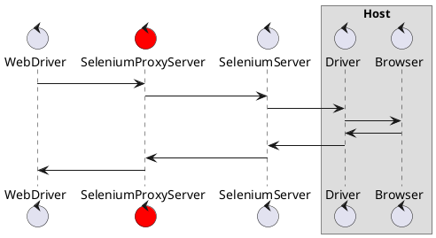

# selenium-proxy-server
Selenium Proxy Server to log request and response

## How WebDriver control Browser

As shown in the following documents [Selenium: Understanding the components](https://www.selenium.dev/documentation/en/webdriver/understanding_the_components/), There are generally three ways to control actual Browser.

1. WebDriver communicate driver **directly on same host system**
2. Remote communication through **Remote WebDriver** which is on the same system as the driver and the browser
3. Remote communication through **Selenium Server** or **Selenium Grid**

This server is only relevant option 3 (using Selenium Server)

## How does selenium-proxy-server act

This server acts as a proxy between Web Driver and SeleniumServer.

## About Selenium Server

TBD

## Supporting Selenium Grid

TBD

## refs

- [Understanding the components](https://www.selenium.dev/documentation/en/webdriver/understanding_the_components/)
- [10分で理解する Selenium](https://qiita.com/Chanmoro/items/9a3c86bb465c1cce738a)