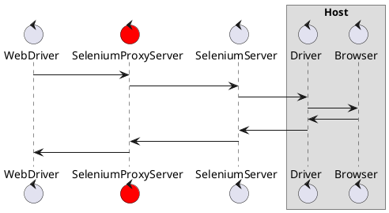

# selenium-proxy-server
Selenium Proxy Server to log request and response

## How WebDriver control Browser

As shown in the following documents [Selenium: Understanding the components](https://www.selenium.dev/documentation/en/webdriver/understanding_the_components/), There are generally three ways to control actual Browser.

1. WebDriver communicate driver **directly on same host system**
2. Remote communication through **Remote WebDriver** which is on the same system as the driver and the browser
3. Remote communication through **Selenium Server (Grid)**

This server is only relevant option 3 (using Selenium Server)


## How does selenium-proxy-server act

This server acts as a proxy between Web Driver and SeleniumServer.



## Demo: session start via cURL

To start session via selenium proxy server, you can get it the following request.

```
$ curl -X POST \
       -H "Content-Type: application/json" \
       -d '{"capabilities": {"firstMatch": [{}], "alwaysMatch": {"browserName": "chrome", "platformName": "any", "goog:chromeOptions": {"extensions": [], "args": ["--headless"]}}}, "desiredCapabilities": {"browserName": "chrome", "version": "", "platform": "ANY", "goog:chromeOptions": {"extensions": [], "args": ["--headless"]}}}' \
       http://localhost:8080/wd/hub/session
{
  "value": {
    "sessionId": "1b1068920b514a61964fedba5c65f18f",
    "capabilities": {
      "acceptInsecureCerts": false,
      "browserName": "chrome",
      "browserVersion": "91.0.4472.114",
      "chrome": {
        "chromedriverVersion": "91.0.4472.101 (af52a90bf87030dd1523486a1cd3ae25c5d76c9b-refs\u002fbranch-heads\u002f4472@{#1462})",
        "userDataDir": "\u002ftmp\u002f.com.google.Chrome.UdbhpQ"
      },
      "goog:chromeOptions": {
        "debuggerAddress": "localhost:46031"
      },
      "networkConnectionEnabled": false,
      "pageLoadStrategy": "normal",
      "platformName": "linux",
      "proxy": {
      },
      "se:cdp": "ws:\u002f\u002f172.23.0.2:4444\u002fsession\u002f1b1068920b514a61964fedba5c65f18f\u002fse\u002fcdp",
      "se:cdpVersion": "91.0.4472.114",
      "se:vnc": "ws:\u002f\u002f172.23.0.2:4444\u002fsession\u002f1b1068920b514a61964fedba5c65f18f\u002fse\u002fvnc",
      "se:vncEnabled": true,
      "se:vncLocalAddress": "ws:\u002f\u002flocalhost:7900\u002fwebsockify",
      "setWindowRect": true,
      "strictFileInteractability": false,
      "timeouts": {
        "implicit": 0,
        "pageLoad": 300000,
        "script": 30000
      },
      "unhandledPromptBehavior": "dismiss and notify",
      "webauthn:extension:largeBlob": true,
      "webauthn:virtualAuthenticators": true
    }
  }
}
```

The selenium proxy server logs the request and response.

```
selenium-proxy-server_1  | request method: 'POST', body: '{"capabilities": {"firstMatch": [{}], "alwaysMatch": {"browserName": "chrome", "platformName": "any", "goog:chromeOptions": {"extensions": [], "args": ["--headless"]}}}, "desiredCapabilities": {"browserName": "chrome", "version": "", "platform": "ANY", "goog:chromeOptions": {"extensions": [], "args": ["--headless"]}}}'

selenium-proxy-server_1  | response status: '200', body: '{
selenium-proxy-server_1  |   "value": {
selenium-proxy-server_1  |     "sessionId": "1b1068920b514a61964fedba5c65f18f",
selenium-proxy-server_1  |     "capabilities": {
selenium-proxy-server_1  |       "acceptInsecureCerts": false,
selenium-proxy-server_1  |       "browserName": "chrome",
selenium-proxy-server_1  |       "browserVersion": "91.0.4472.114",
selenium-proxy-server_1  |       "chrome": {
selenium-proxy-server_1  |         "chromedriverVersion": "91.0.4472.101 (af52a90bf87030dd1523486a1cd3ae25c5d76c9b-refs\u002fbranch-heads\u002f4472@{#1462})",
selenium-proxy-server_1  |         "userDataDir": "\u002ftmp\u002f.com.google.Chrome.UdbhpQ"
selenium-proxy-server_1  |       },
selenium-proxy-server_1  |       "goog:chromeOptions": {
selenium-proxy-server_1  |         "debuggerAddress": "localhost:46031"
selenium-proxy-server_1  |       },
selenium-proxy-server_1  |       "networkConnectionEnabled": false,
selenium-proxy-server_1  |       "pageLoadStrategy": "normal",
selenium-proxy-server_1  |       "platformName": "linux",
selenium-proxy-server_1  |       "proxy": {
selenium-proxy-server_1  |       },
selenium-proxy-server_1  |       "se:cdp": "ws:\u002f\u002f172.23.0.2:4444\u002fsession\u002f1b1068920b514a61964fedba5c65f18f\u002fse\u002fcdp",
selenium-proxy-server_1  |       "se:cdpVersion": "91.0.4472.114",
selenium-proxy-server_1  |       "se:vnc": "ws:\u002f\u002f172.23.0.2:4444\u002fsession\u002f1b1068920b514a61964fedba5c65f18f\u002fse\u002fvnc",
selenium-proxy-server_1  |       "se:vncEnabled": true,
selenium-proxy-server_1  |       "se:vncLocalAddress": "ws:\u002f\u002flocalhost:7900\u002fwebsockify",
selenium-proxy-server_1  |       "setWindowRect": true,
selenium-proxy-server_1  |       "strictFileInteractability": false,
selenium-proxy-server_1  |       "timeouts": {
selenium-proxy-server_1  |         "implicit": 0,
selenium-proxy-server_1  |         "pageLoad": 300000,
selenium-proxy-server_1  |         "script": 30000
selenium-proxy-server_1  |       },
selenium-proxy-server_1  |       "unhandledPromptBehavior": "dismiss and notify",
selenium-proxy-server_1  |       "webauthn:extension:largeBlob": true,
selenium-proxy-server_1  |       "webauthn:virtualAuthenticators": true
selenium-proxy-server_1  |     }
selenium-proxy-server_1  |   }
selenium-proxy-server_1  | }'
```

## Demo: Python code (go to google.com)

Here is the following python code.

```python
from selenium import webdriver


options = webdriver.ChromeOptions()
options.add_argument('--headless')

driver = webdriver.Remote(
    command_executor='http://localhost:8080/wd/hub',
    desired_capabilities=options.to_capabilities(),
    options=options,
)

driver.get('https://www.google.com/')
print(driver.current_url)

driver.quit()
```

Run it.

```
$ python example/go_google.py

https://www.google.com/
```

While running, the selenium proxy server logs the following.

```
selenium-proxy-server_1  | request method: 'POST', body: '{"capabilities": {"firstMatch": [{}], "alwaysMatch": {"browserName": "chrome", "platformName": "any", "goog:chromeOptions": {"extensions": [], "args": ["--headless"]}}}, "desiredCapabilities": {"browserName": "chrome", "version": "", "platform": "ANY", "goog:chromeOptions": {"extensions": [], "args": ["--headless"]}}}'
selenium-proxy-server_1  | response status: '200', body: '{
selenium-proxy-server_1  |   "value": {
selenium-proxy-server_1  |     "sessionId": "a327ca9c5bf35fd5832720b5a8e3bf17",
selenium-proxy-server_1  |     "capabilities": {
selenium-proxy-server_1  |       "acceptInsecureCerts": false,
selenium-proxy-server_1  |       "browserName": "chrome",
selenium-proxy-server_1  |       "browserVersion": "91.0.4472.114",
selenium-proxy-server_1  |       "chrome": {
selenium-proxy-server_1  |         "chromedriverVersion": "91.0.4472.101 (af52a90bf87030dd1523486a1cd3ae25c5d76c9b-refs\u002fbranch-heads\u002f4472@{#1462})",
selenium-proxy-server_1  |         "userDataDir": "\u002ftmp\u002f.com.google.Chrome.Uiy0jQ"
selenium-proxy-server_1  |       },
selenium-proxy-server_1  |       "goog:chromeOptions": {
selenium-proxy-server_1  |         "debuggerAddress": "localhost:41765"
selenium-proxy-server_1  |       },
selenium-proxy-server_1  |       "networkConnectionEnabled": false,
selenium-proxy-server_1  |       "pageLoadStrategy": "normal",
selenium-proxy-server_1  |       "platformName": "ANY",
selenium-proxy-server_1  |       "proxy": {
selenium-proxy-server_1  |       },
selenium-proxy-server_1  |       "se:cdp": "ws:\u002f\u002f172.23.0.2:4444\u002fsession\u002fa327ca9c5bf35fd5832720b5a8e3bf17\u002fse\u002fcdp",
selenium-proxy-server_1  |       "se:cdpVersion": "91.0.4472.114",
selenium-proxy-server_1  |       "se:vnc": "ws:\u002f\u002f172.23.0.2:4444\u002fsession\u002fa327ca9c5bf35fd5832720b5a8e3bf17\u002fse\u002fvnc",
selenium-proxy-server_1  |       "se:vncEnabled": true,
selenium-proxy-server_1  |       "se:vncLocalAddress": "ws:\u002f\u002flocalhost:7900\u002fwebsockify",
selenium-proxy-server_1  |       "setWindowRect": true,
selenium-proxy-server_1  |       "strictFileInteractability": false,
selenium-proxy-server_1  |       "timeouts": {
selenium-proxy-server_1  |         "implicit": 0,
selenium-proxy-server_1  |         "pageLoad": 300000,
selenium-proxy-server_1  |         "script": 30000
selenium-proxy-server_1  |       },
selenium-proxy-server_1  |       "unhandledPromptBehavior": "dismiss and notify",
selenium-proxy-server_1  |       "webauthn:extension:largeBlob": true,
selenium-proxy-server_1  |       "webauthn:virtualAuthenticators": true
selenium-proxy-server_1  |     }
selenium-proxy-server_1  |   }
selenium-proxy-server_1  | }'
selenium-proxy-server_1  | request method: 'POST', body: '{"url": "https://www.google.com/"}'
selenium-proxy-server_1  | response status: '200', body: '{"value":null}'
selenium-proxy-server_1  | request method: 'GET', body: ''
selenium-proxy-server_1  | response status: '200', body: '{"value":"https://www.google.com/"}'
selenium-proxy-server_1  | request method: 'DELETE', body: ''
selenium-proxy-server_1  | response status: '200', body: '{"value":null}'
```

## About Selenium Server

Selenium Grid is following...

> If you want to scale by distributing and running tests on several machines and manage multiple environments from a central point, making it easy to run the tests against a vast combination of browsers/OS, then you want to use Selenium Grid.
> 
> https://www.selenium.dev/

You can download at [Downloads](https://www.selenium.dev/downloads/) page.

Docker image for the Selenium Grid Server is here. https://github.com/SeleniumHQ/docker-selenium

## Setup local environment

Setup three components in local environment.

- Selenium Server
- Selenium Proxy Server
- Selenium Code (Python)

```
$ docker-compose up
```

When Selenium server starts, the following log is output.

```
2021-06-26 07:00:21,642 INFO Included extra file "/etc/supervisor/conf.d/selenium.conf" during parsing
2021-06-26 07:00:21,644 INFO supervisord started with pid 9
2021-06-26 07:00:22,653 INFO spawned: 'xvfb' with pid 11
2021-06-26 07:00:22,658 INFO spawned: 'vnc' with pid 12
2021-06-26 07:00:22,661 INFO spawned: 'novnc' with pid 13
2021-06-26 07:00:22,665 INFO spawned: 'selenium-standalone' with pid 14
2021-06-26 07:00:22,685 INFO success: xvfb entered RUNNING state, process has stayed up for > than 0 seconds (startsecs)
2021-06-26 07:00:22,685 INFO success: vnc entered RUNNING state, process has stayed up for > than 0 seconds (startsecs)
2021-06-26 07:00:22,685 INFO success: novnc entered RUNNING state, process has stayed up for > than 0 seconds (startsecs)
2021-06-26 07:00:22,685 INFO success: selenium-standalone entered RUNNING state, process has stayed up for > than 0 seconds (startsecs)
Selenium Grid Standalone configuration:
[network]
relax-checks = true

[node]
session-timeout = "300"
override-max-sessions = false
detect-drivers = false
max-sessions = 1

[[node.driver-configuration]]
name = "chrome"
stereotype = '{"browserName": "chrome", "browserVersion": "91.0", "platformName": "Linux"}'
max-sessions = 1

Starting Selenium Grid Standalone...
07:00:23.285 INFO [LoggingOptions.configureLogEncoding] - Using the system default encoding
07:00:23.291 INFO [OpenTelemetryTracer.createTracer] - Using OpenTelemetry for tracing
07:00:24.296 INFO [NodeOptions.getSessionFactories] - Detected 4 available processors
07:00:24.369 INFO [NodeOptions.report] - Adding chrome for {"browserVersion": "91.0","browserName": "chrome","platformName": "Linux","se:vncEnabled": true} 1 times
07:00:24.392 INFO [Node.<init>] - Binding additional locator mechanisms: id, name
07:00:24.415 INFO [LocalDistributor.add] - Added node 218787d9-1433-40fc-a6c2-792e573c1a68 at http://172.17.0.2:4444.
07:00:24.419 INFO [LocalGridModel.setAvailability] - Switching node 218787d9-1433-40fc-a6c2-792e573c1a68 (uri: http://172.17.0.2:4444) from DOWN to UP
07:00:24.652 INFO [Standalone.execute] - Started Selenium Standalone 4.0.0-rc-1 (revision 23ece4f646): http://172.17.0.2:4444
```

## refs

- [10分で理解する Selenium](https://qiita.com/Chanmoro/items/9a3c86bb465c1cce738a)
- [入門、Selenium  第1回 Seleniumの仕組み](https://www.codegrid.net/articles/2014-selenium-1/)
